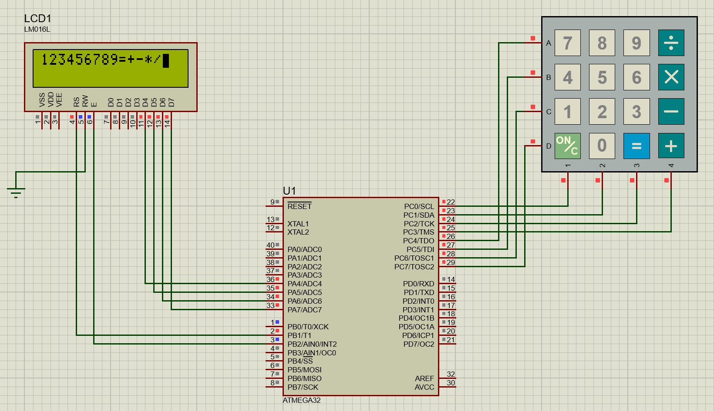

# D108 - AVR Microcontroller Driver Workspace

A highly modular firmware application built for AVR architecture (e.g., ATmega32) using **Atmel Studio 7.0**. This repository implements a layered software architecture featuring custom hardware abstraction drivers for Character LCDs (CLCD) and Keypads (KPAD).

## Software Architecture

The codebase follows an industry-standard layered design pattern to maximize code reusability and hardware independence.

## 🛠️ How to Build and Run

### Using Microchip Studio / Atmel Studio 7.0
1. **Clone this repository to your local computer:**
```bash
git clone https://github.com/adhamaglan/Amit-C-Embedded-D108-.git
```

2. **Launch Microchip Studio (Atmel Studio 7.0).**

3. **Select File > Open > Project/Solution... and open the project solution file (`.atsln`).**

4. **Build solution and burn the `.hex` file on your `ATmega32` chip**

## 📂 Repository Structure

<details open>
<summary><b>📦 Project Root Workspace</b></summary>

* 📄 **`main.c`** — Application entry point.

<blockquote>

### 📑 Layered Architecture Breakdown

<details>
<summary>📂 <b>MCAL</b> (Microcontroller Abstraction Layer)</summary>

* 📄 **`regdef.h`** — Direct volatile memory-mapped register pointer definitions for AVR (Atmega32).
<details>
<summary>&nbsp;&nbsp;&nbsp;&nbsp;📂 <b>DIO/</b> (Digital Input/Output Driver)</summary>

* 📄 `dio.c` — Implementation of pin/port controls ( direction, value, etc... ).
* 📄 `dio.h` — Pin/Port directions and macro definitions.
</details>
</details>

<details>
<summary>📂 <b>HAL</b> (Hardware Abstraction Layer)</summary>

<details>
<summary>&nbsp;&nbsp;&nbsp;&nbsp;📂 <b>CLCD/</b> (Character LCD Driver)</summary>

* 📄 `CLCD_config.h` — Interface pin routing layout.
* 📄 `CLCD_int.h` — Character LCD Functions declarations.
* 📄 `CLCD_priv.h` — Private operational bits.
* 📄 `CLCD_prog.c` — Character LCD Functions implementations.
</details>

<details>
<summary>&nbsp;&nbsp;&nbsp;&nbsp;📂 <b>KPAD/</b> (Matrix Keypad Driver)</summary>

* 📄 `KPAD_config.h` — Row/column matrix pins.
* 📄 `KPAD_int.h` — Matrix keypad Functions declarations.
* 📄 `KPAD_prog.c` — Matrix keypad Functions implementations.
</details>
</details>

<details>
<summary>📂 <b>service</b> (Shared Utilities Layer)</summary>

* 📄 **`bit_math.h`** — Highly optimized bitwise macro functions (`SET_BIT`, `CLR_BIT`, `GET_BIT`, etc...).
* 📄 **`std_types.h`** — Platform-independent strict width primitive overrides (`u8`, `s16`, `f32`, etc...).
</details>

</blockquote>
</details>


---

## 🎛️ Peripheral Configurations

### 1. Character LCD (CLCD)
The system is configured to run both optimized **4-Bit Mode** and **8-Bit Mode**.
* **The interface:** 
    * 8-Bit Mode -> `CLCD_8_BITS`
    * 4-Bit Mode -> `CLCD_4_BITS`
* **Data Port:** `CLCD_DATA_PORTx`
<details style="margin-top: 5px; margin-bottom: 10px; margin-left: 20px;">
<summary> IMP! While using 4-bitmode. </summary>

* user inputs the GPIO Pins for :
    * CLCD_DATA_PIN<code>x<sub>0</sub></code>
    * CLCD_DATA_PIN<code>x<sub>1</sub></code>
    * CLCD_DATA_PIN<code>x<sub>2</sub></code>
    * CLCD_DATA_PIN<code>x<sub>3</sub></code>
</details>

* **Control Port:** `CLCD_CTRL_PORTx`
    * The user inputs the GPIO pins for :
        * CLCD_RS_PIN`x`
        * CLCD_RW_PIN`x`
        * CLCD_E_PIN`x`
* **Data Nibble (only on 4-bit interface):** Pins configured are mapped to data lines `D4`-`D7`

### 2. Keypad (KPAD)
The Keypad is a 4x4 Matrix containing 16 buttons
* **The interface:** 
    * it is configured to run in `8 GPIO pins`
<details style="margin-top: 5px; margin-bottom: 10px; margin-left: 20px;">
<summary> Data Port/Ports: <code>KPAD_COL_PORTx</code> & <code>KPAD_ROW_PORTx</code> </summary>

* user inputs the GPIO Pins for :
    * **KPAD_COL_PORT`x`**
        * KPAD_COL_PIN<code>x<sub>0</sub></code>
        * KPAD_COL_PIN<code>x<sub>1</sub></code>
        * KPAD_COL_PIN<code>x<sub>2</sub></code>
        * KPAD_COL_PIN<code>x<sub>3</sub></code>

    * **KPAD_ROW_PORT`x`**
        * KPAD_ROW_PIN<code>x<sub>0</sub></code>
        * KPAD_ROW_PIN<code>x<sub>1</sub></code>
        * KPAD_ROW_PIN<code>x<sub>2</sub></code>
        * KPAD_ROW_PIN<code>x<sub>3</sub></code>
</details>


## 📌 API Reference

### DIO Subsystem (`dio.h`)
```c
void DIO_voidSetPinDir (u8 Copy_u8PortID, u8 Copy_u8PinID, u8 Copy_u8Dir); 
// allows user to set `pin` to input/output

void DIO_voidSetPinVal (u8 Copy_u8PortID, u8 Copy_u8PinID, u8 Copy_u8Val);
// allows user to set `pin` to High/Low

u8 DIO_u8GetPinVal (u8 Copy_u8PortID, u8 Copy_u8PinID);
// allows user to get `pin` data

void DIO_voidSetPortDir (u8 Copy_u8PortID, u8 Copy_u8Dir);
// allows user to set `port` to input/output

void DIO_voidSetPortVal (u8 Copy_u8PortID, u8 Copy_u8Val);
// allows user to set `port` to High/Low

u8 DIO_u8GetPortVal (u8 Copy_u8PortID);
// allows user to get `port` data

void DIO_voidTogPinVal (u8 Copy_u8PortID,u8 Copy_u8PinID);
// allows user to toggle `pin` states 1/0

void DIO_voidEnablePullUp (u8 Copy_u8PortID,u8 Copy_u8PinID);
// allows user to set `pin` to pull-up
```

### LCD Subsystem (`CLCD_int.h`)
```c
void CLCD_voidInit(void);
// initializes the LCD

void CLCD_voidSendData (u8 Copy_u8Data);
// allows user to send data to LCD

void CLCD_voidSendInst (u8 Copy_u8Data);
// allows user to send instruction/command to LCD

void CLCD_voidSendString (const u8 *Copy_u8Str);
// allows user to send a string to LCD (using send data function)

void CLCD_voidSetCursorPos (u8 Copy_u8x,u8 Copy_u8y);
// allows user to control cursor position

void CLCD_voidClearScreen (void);
// clears LCD screen

void CLCD_voidSendSpecialChar (u8 Copy_u8Index, const u8 *Copy_u8Arr, u8 Copy_u8x, u8 Copy_u8y);
// allows user to create special characters and store them in CGRAM and send it to LCD
```
### Keypad Subsystem  (`KPAD_int.h`)
```c
void KPAD_voidInit (void);
// initializes the Keypad

u8 KPAD_u8GetKeyPressed (void);
// allows the user to get the pressed key
```
---
## Interactive Showcase
**Here is the main.c working on Proteus! This example initializes the CLCD and KPAD drivers and continuously reads keypad input, displaying pressed characters on the LCD and clearing the display when the ON/C button ('c') is pressed.**

<p align="center">
  
</p>
